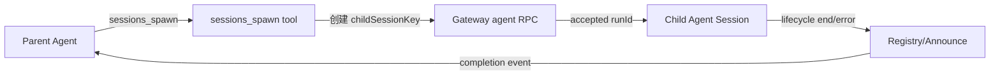

# OpenClaw Agent Runtime

## 核心定义

OpenClaw 是一个"多入口消息网关 + session 化 agent runtime + 插件/工具编排层"。用户请求可以来自 CLI、Gateway RPC、WebChat/TUI 或各类消息 channel。核心执行路径统一到 `agent` 请求和 `agentCommand`。^[raw/openclaw-runtime-analysis.md]

## 架构分层

| 层 | 责任 |
|---|---|
| Channel/Client | 归一化 Telegram、Discord、WebChat、TUI、CLI 等输入 |
| Gateway | RPC 协议、鉴权、session 解析、delivery route、幂等、abort、SSE/WebSocket broadcast |
| Agent command | 解析 model/provider/runtime、session transcript、技能、thinking/fallback |
| Agent runtime | 拥有一次准备好的模型循环（PI embedded / Codex harness / CLI backend） |
| Context engine | context bootstrap、assemble、compact、afterTurn、subagent context |
| Tools/plugin | 文件、shell、message、session、subagent、plugin tools + before/after hook |
| Session/transcript | 历史消息、工具调用、usage、compaction 结果 |

## 请求入口：Gateway 调度

`agent` RPC handler 核心流程：
1. 解析 session：显式 sessionKey / agent main session / subagent session / channel 绑定 → 归一化为 run 使用的 sessionKey
2. 解析 delivery route：channel、account、to、threadId
3. 注册 abort controller
4. 立即返回 `accepted(runId)`，后台异步执行
5. `agentCommandFromIngress` 完成后写入 terminal dedupe 快照
6. 客户端用 `agent.wait(runId)` 等待同步结果

关键设计取舍：先 accepted、后台执行，避免长 LLM/tool run 阻塞 RPC。^[raw/openclaw-runtime-analysis.md]

## Runtime 选择与 AgentHarness V2

`runAgentAttempt` 分流：
- `raw model run` → 强制 PI/raw path
- CLI provider/backend → `runCliAgent`
- 默认 → `runEmbeddedPiAgent`
- `agentHarnessPolicy` 再分：PI embedded loop / AgentHarness V2 lifecycle

### AgentHarness V2 Lifecycle

```
prepare → start → send → handleToolCall → resolveOutcome → cleanup
```

接口：`supports`(自检) → `prepare`(预解析) → `start`(建连接) → `send`(完整 turn) → `handleToolCall`(统一工具策略) → `resolveOutcome`(清洗结果) → `cleanup`(资源回收)。^[raw/openclaw-runtime-analysis.md]

旧 V1 harness 通过 `adaptAgentHarnessToV2` 适配，新旧在同一调度中共存。

## Context 组织

context 不是单一字符串，而是全部发送材料的集合：
- **System prompt**：每次 run 重建，工具说明 + 技能列表 + workspace + time + runtime metadata + channel hints
- **Project Context**：AGENTS.md、SOUL.md、TOOLS.md、IDENTITY.md、USER.md、HEARTBEAT.md、BOOTSTRAP.md
- **Session transcript**：历史 user/assistant/tool messages + compaction summary
- **当前 prompt**：可能被 hook prepend/append 修改
- **Tool definitions**：文本进 system prompt；schema 进 provider tool schema
- **附件/媒体**：图片、音频、文件解析为 prompt 注释或 provider images
- **Plugin hook 注入**：`before_prompt_build` 可注入 prependContext/appendContext/systemPrompt
- **Context engine 输出**：assemble 后可精简 messages + systemPromptAddition

## Context Engine 生命周期

默认 `legacy` engine 行为保守：ingest(no-op)、assemble(pass-through)、compact(委托内置)、afterTurn(no-op)、maintain(未实现)。

完整可选生命周期：`bootstrap → ingest → assemble → compact → afterTurn → maintain → prepareSubagentSpawn`

插件 engine 关键约束：
- `ownsCompaction: true` 时禁用 PI 内置 auto-compaction
- `maintain()` 必须经 `runtimeContext.rewriteTranscriptEntries()` 走 session write lock
- 同一个 context engine 同时服务 PI embedded loop 和 codex/plugin harness^[raw/openclaw-runtime-analysis.md]

## Compaction 三类触发

| 触发 | 入口 | 关键字段 | 行为 |
|------|------|---------|------|
| Overflow recovery | run.ts | trigger: "overflow", compactionTarget: "budget", force: true | provider 返回 overflow / 估算超窗时；成功后 maintain + retry |
| Timeout-triggered | run.ts | trigger: "timeout_recovery", force: true | LLM stream 超时且 prompt token > 65%；最多 N 次 |
| Queued/手动 | compact.queued.ts | trigger: "manual", compactionTarget: "threshold/budget" | `/compact` 或调度任务；先跑 before_compaction hook |

同一 session 同一时刻只跑一种 compaction，由 `compact.queued` 串行。

## Agent 协同：session 级隔离



两种上下文模式：
- **isolated**（默认）：child session 不继承父 transcript，干净上下文
- **fork**（显式）：复制父 session transcript，适合需要父会话历史的子任务

默认安全边界是隔离会话 + 显式结果回传，不是共享整个上下文窗口——减少 token 压力，降低子 agent 误读父推理的风险。^[raw/openclaw-runtime-analysis.md]

## 关键设计取舍

1. **Gateway 先 accepted，后台执行** — `agent.wait` 补齐同步语义
2. **session lane 串行化** — 避免工具结果、compaction 和历史重放竞态
3. **context 每轮重建** — 系统提示/工具/技能/runtime metadata 重算
4. **context engine 可插拔** —  通过 `rewriteTranscriptEntries()` 安全重写 transcript
5. **工具循环由 runtime 驱动，OpenClaw 做边界包装** — 工具注册、策略、流桥接、诊断、delivery
6. **子 agent 是 session 级隔离，不是线程内函数调用** — 通过 Gateway 再入启动完整 agent loop
7. **消息 channel 与 agent runtime 解耦** — 同一 agent loop 可从 Telegram/Discord/WebChat/CLI 触发
8. **AgentHarness V2 拆成显式阶段** — codex/plugin harness 与 PI 共享调度
9. **Compaction 三类触发统一入口** — 仅以 trigger 字段区分
10. **横切关注点边界化** — backend.ts/attempt-http-runtime.ts/attempt-bootstrap-routing.ts

## 相关概念

- [[claw-code-runtime]] — Claw Code Agent Runtime 对比
- [[ai-coding-agent]] — AI Coding Agent 工程方法论
- [[agent-memory]] — Agent 记忆系统与 session 管理
- [[multi-agent-collaboration]] — 多 Agent 协作模式对比
- [[harness-engineering]] — 驾驭 Agent 的核心工程方法
