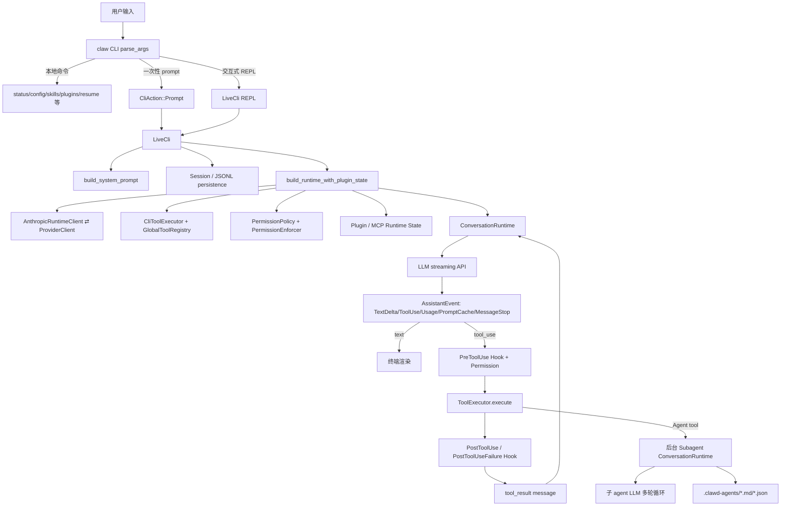
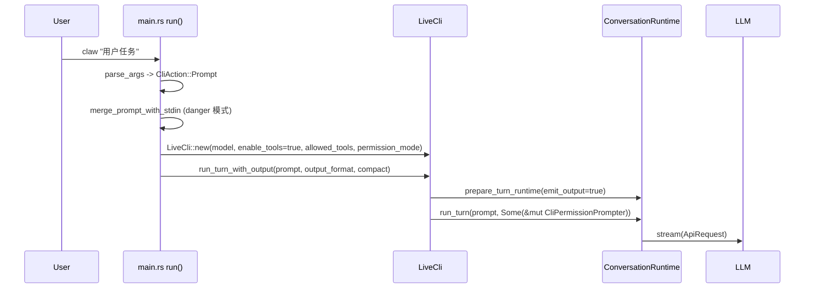
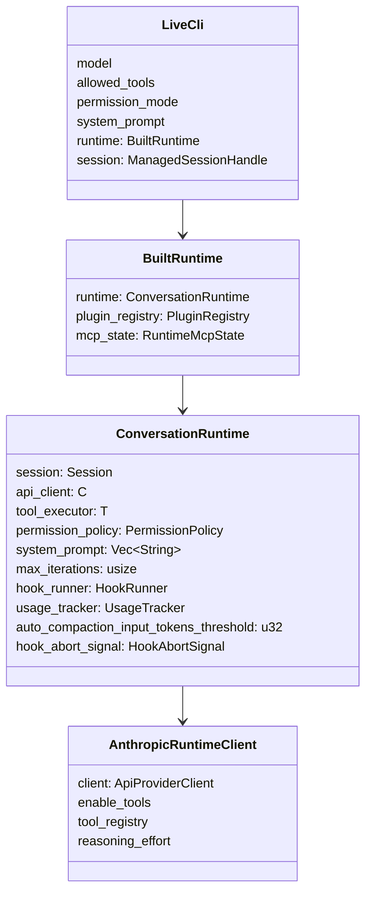
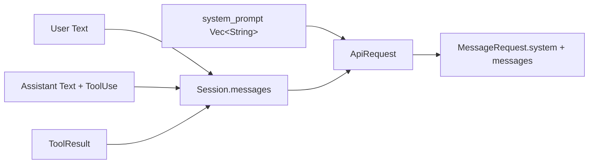
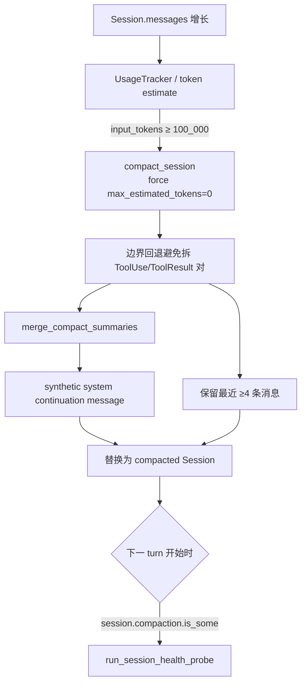
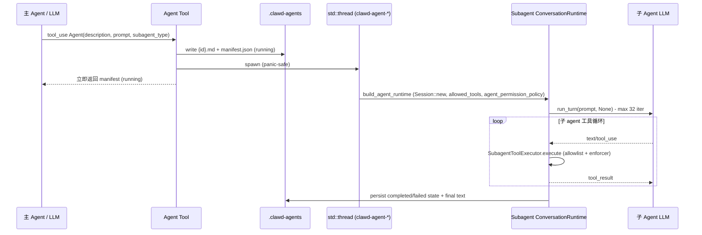
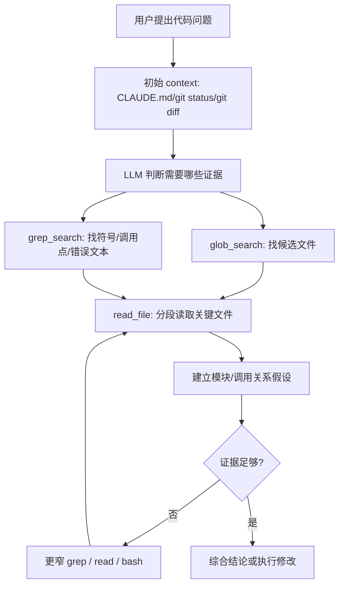
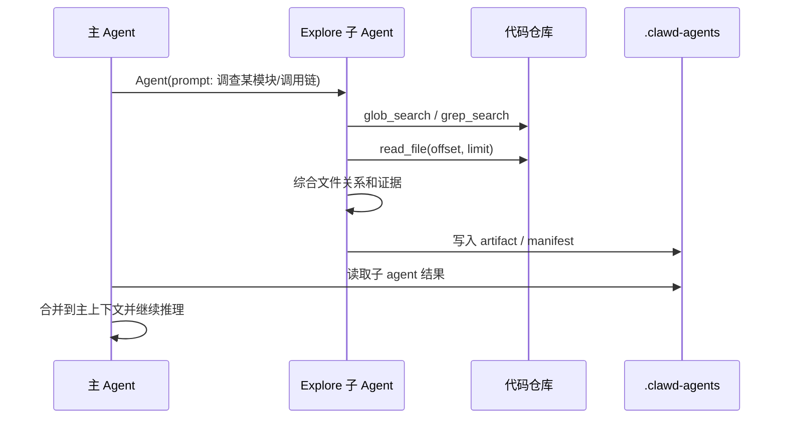
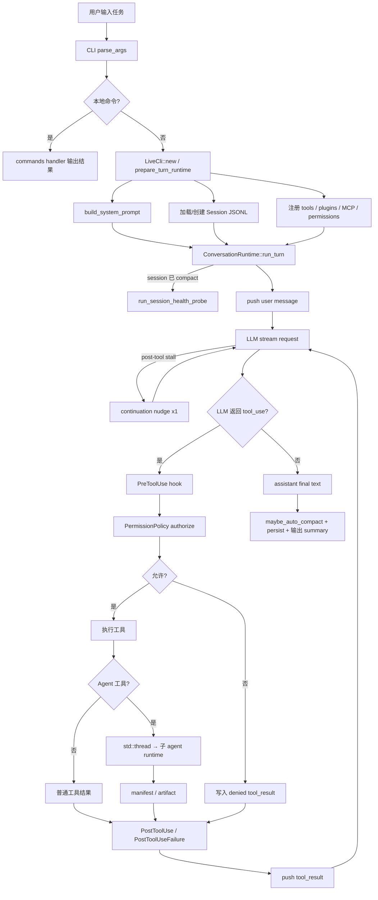

# Claw Code Runtime 分析

> 分析对象：`/Users/insunny/Documents/codespace/claw-code`（commit `cb56dc1`，9 lanes 全部 merged）
>
> 同目录的另一份分析：`./openclaw-runtime-analysis.md`，描述 `../openclaw` 的 runtime；本文末尾给出两者对照。
>
> 范围说明：本文分析的是 `claw-code` 仓库中的开源 Rust 实现（Anthropic 风格的 agent harness），不是 Anthropic 官方闭源 Claude Code 本体。该仓库自我定位见 `PHILOSOPHY.md`：它是“humans set direction; claws perform the labor”这一 autonomous-development demo 的产物，主要展示 clawhip / OmX / OmO 三件套协调下能跑出什么样的 harness——理解原理对外推官方实现仍有参考价值，但不应把它当作官方实现的字节级 mirror。

## 1. 结论摘要

`claw-code` 的主运行链路可以概括为：

1. **CLI 入口分发**：`parse_args` 区分一次性 prompt、交互式 REPL、slash command、`status / config / resume / skills / plugins` 等本地命令。
2. **运行时装配**：真正需要 LLM 的请求落到 `LiveCli`，把 system prompt、`Session`、`GlobalToolRegistry`、`PermissionPolicy`、plugin/MCP 状态、provider client 装配进同一个 `ConversationRuntime`。
3. **Run-turn 主循环**：`ConversationRuntime::run_turn` 把用户输入追加到 `Session.messages`，进入 “LLM streaming → 解析 text/tool_use → hook + permission → 执行工具 → 写入 tool_result → 再次请求 LLM” 的迭代，直到模型不再输出 tool_use 或触发上限/失败。
4. **Context 组织**：发送给模型的 context 不是单一字符串，而是 `system_prompt: Vec<String>` + `Session.messages: Vec<ConversationMessage>`。系统提示由 SystemPromptBuilder 按 5 段模板 + dynamic boundary + 环境/项目/配置/append 段组装；会话消息持续累积 user / assistant / tool_use / tool_result。
5. **Agent 协同 = Tool 调用**：claw-code 不在 harness 层强行起多 agent，而是把 `Agent` 暴露成 LLM 可调用的工具。一旦调用，工具层创建 `.clawd-agents/{agent_id}.{md,json}`，**后台 `std::thread`** 启动一个独立 `ConversationRuntime`，使用受限工具白名单和 subagent system prompt 执行委派任务。
6. **Provider 与 streaming**：`ProviderClient` 抽象 Anthropic / xAI / OpenAI-compat（含 DashScope 路由），统一以 `MessageRequest { stream: true, tools, tool_choice: Auto, ... }` 发起；流事件聚合成 `Vec<AssistantEvent>` 反馈给 runtime。post-tool 阶段有 stall-timeout + 一次重发的 “continuation nudge” 保护。

**核心源码证据（截至 commit `cb56dc1`）**：

| 关注点 | 文件 | 行号 |
| --- | --- | --- |
| CLI 入口、`CliAction::Prompt` 分发 | `rust/crates/rusty-claude-cli/src/main.rs` | `:336` |
| `LiveCli::new` 装配 system prompt / session / runtime | `rust/crates/rusty-claude-cli/src/main.rs` | `:4138` |
| `prepare_turn_runtime` 每 turn 重建 runtime | `rust/crates/rusty-claude-cli/src/main.rs` | `:4233` |
| `build_runtime_with_plugin_state` | `rust/crates/rusty-claude-cli/src/main.rs` | `:7298` |
| `ApiClient for AnthropicRuntimeClient` 的 streaming 实现 | `rust/crates/rusty-claude-cli/src/main.rs` | `:7530` |
| Runtime 主循环 `run_turn` | `rust/crates/runtime/src/conversation.rs` | `:314` |
| `ConversationRuntime` 字段定义 | `rust/crates/runtime/src/conversation.rs` | `:126` |
| `maybe_auto_compact` + 阈值常量 | `rust/crates/runtime/src/conversation.rs` | `:18`, `:555` |
| `SystemPromptBuilder` + `FRONTIER_MODEL_NAME` | `rust/crates/runtime/src/prompt.rs` | `:42`, `:95` |
| `Session` / `MessageRole` / `ContentBlock` | `rust/crates/runtime/src/session.rs` | `:81+` |
| `compact_session` + tool-pair 边界保护 | `rust/crates/runtime/src/compact.rs` | `:96`, `:121–158` |
| `mvp_tool_specs()`（共 50 条） | `rust/crates/tools/src/lib.rs` | `:392` |
| `Agent` 工具执行 + 后台线程 | `rust/crates/tools/src/lib.rs` | `:3484`, `:3568`, `:3595` |
| `allowed_tools_for_subagent` 白名单 | `rust/crates/tools/src/lib.rs` | `:3649` |
| `ProviderClient` provider 抽象 | `rust/crates/api/src/client.rs` | `:10`, `:21` |
| Slash 命令注册 | `rust/crates/commands/src/lib.rs` | `:59` |

## 2. 总体架构



## 3. 用户请求入口

`main.rs` 顶层 `run()` 是 CLI 顶层分发。`parse_args` 返回不同 `CliAction` 后：

- **本地 introspection**：`status / config / sessions / skills / plugins / resume / fork / output-styles` 等直接执行，不进入 LLM。
- **一次性 prompt**：`CliAction::Prompt` → `LiveCli::run_turn_with_output`。danger-full-access 模式还会合并 piped stdin；非 unattended 模式保留 stdin 给权限确认交互。
- **REPL**：普通文本输入进入 `LiveCli::run_turn`；以 `/` 开头的输入先匹配 `commands/src/lib.rs:59` 的 `SLASH_COMMAND_SPECS`（如 `/status` `/compact` `/model` `/permissions` `/resume` `/diff` `/commit` `/teleport` `/bughunter` `/ultraplan` 等）。



注意 `prepare_turn_runtime` 每个 turn **都会重建 BuiltRuntime**（重新解析 plugin/MCP/系统提示），但复用 `Session`。这意味着插件、MCP 工具、permission 改动可以在 turn 之间动态生效，无需重启进程。

## 4. Runtime 装配

`LiveCli::new` 做三件关键事：

1. `build_system_prompt()` 生成系统提示。
2. `new_cli_session()` + `create_managed_session_handle()` 创建 session 并绑定 JSONL 持久化路径。
3. `build_runtime(...)` 生成 `BuiltRuntime`，包含 `ConversationRuntime`、plugin registry 与 MCP state。

`build_runtime_with_plugin_state` 的装配逻辑（`main.rs:7298`）：

- 初始化 `PluginRegistry`，发现 `.claw/plugins/**` 与配置中的插件。
- 根据 `permission_mode` + feature config + tool registry 构造 `PermissionPolicy`。
- 构造 `AnthropicRuntimeClient`（实际是对 `ProviderClient` 的 wrapper，加上 reasoning_effort、emit_output、progress_reporter 等 CLI 状态）。
- 构造 `CliToolExecutor`（`tools/src/lib.rs:348`），它在执行前调用 `execute_tool_with_enforcer`，统一插入 `PermissionEnforcer` 检查。
- 调用 `ConversationRuntime::new_with_features`，把 session、api_client、tool_executor、permission_policy、system_prompt、`RuntimeFeatureConfig` 合并。



## 5. Context 如何组织

### 5.1 System prompt

`runtime/src/prompt.rs::SystemPromptBuilder` 把 context 拆成 `Vec<String>`，发送时用 `"\n\n".join(...)` 拼成 request 的 `system` 字段。固定模板顺序（`prompt.rs:144`）：

1. `get_simple_intro_section` —— 身份与可选 output style。
2. `get_simple_system_section` —— 通用系统行为约束。
3. `get_simple_doing_tasks_section` —— 任务执行规则。
4. `get_actions_section` —— 工具/动作规范。
5. `SYSTEM_PROMPT_DYNAMIC_BOUNDARY` —— 静态/动态分界 marker。
6. `environment_section` —— `Model family: Claude Opus 4.6`、cwd、date、`{os_name} {os_version}`。
7. `render_project_context` —— 来自 `ProjectContext::discover_with_git`：cwd、当前日期、`git status --short --branch`、staged+unstaged `git diff`、`GitContext` 探测结果。
8. `render_instruction_files` —— 沿 root→cwd 搜集 `CLAUDE.md`、`CLAUDE.local.md`、`.claw/CLAUDE.md`、`.claw/instructions.md`，单文件上限 `MAX_INSTRUCTION_FILE_CHARS = 4_000` 字符，总上限 `MAX_TOTAL_INSTRUCTION_CHARS = 12_000`。
9. `render_config_section` —— RuntimeConfig 摘要。
10. `append_sections` —— 调用方追加（如 subagent 的 “you are a background sub-agent…” 段就由这里挂上）。

关键常量：

| 常量 | 值 | 作用 |
| --- | --- | --- |
| `FRONTIER_MODEL_NAME` | `"Claude Opus 4.6"` | environment 段中 “Model family” 字段 |
| `SYSTEM_PROMPT_DYNAMIC_BOUNDARY` | `"__SYSTEM_PROMPT_DYNAMIC_BOUNDARY__"` | 静态 / 动态分隔，便于压缩与截断时识别 |
| `MAX_INSTRUCTION_FILE_CHARS` | 4 000 | 单 instruction 文件硬上限 |
| `MAX_TOTAL_INSTRUCTION_CHARS` | 12 000 | instruction files 累加上限 |

### 5.2 Session messages

`runtime/src/session.rs` 定义会话消息模型：

- `MessageRole`：`System` / `User` / `Assistant` / `Tool`
- `ContentBlock`：`Text` / `ToolUse { id, name, input }` / `ToolResult { tool_use_id, tool_name, content, is_error }`
- `ConversationMessage`：`role` + `blocks` + 可选 `usage`
- `Session`：`session_id`、created/updated、`messages`、compaction metadata、fork metadata、workspace root、prompt history、model、persistence path

`run_turn` 将用户文本作为 user message 写入 session；LLM 返回的 `text` / `tool_use` 组装成 assistant message；工具执行结果再写成 tool-role message。下一轮 `ApiRequest.messages = session.messages.clone()`，模型每次都看到完整历史。



### 5.3 持久化、恢复和压缩

Session 既支持 JSON object 整体读取，也支持 JSONL append 流式读取；运行期主要走 JSONL：

- `save_to_path` 生成完整 JSONL snapshot，必要时 rotate。
- `push_message` 内存追加 + 增量 append；append 失败时回滚内存消息，避免内存与磁盘漂移。
- JSONL record 类型：`session_meta` / `message` / `compaction` / `prompt_history`。
- `fork(branch_name)` 复制 session 用于 `/fork`。
- `resume` 通过 `ManagedSessionHandle` 列举与重建。

**自动压缩**（`conversation.rs:18`、`:555`）：

```rust
const DEFAULT_AUTO_COMPACTION_INPUT_TOKENS_THRESHOLD: u32 = 100_000;
const AUTO_COMPACTION_THRESHOLD_ENV_VAR: &str = "CLAUDE_CODE_AUTO_COMPACT_INPUT_TOKENS";
```

每个 turn 结束后调用 `maybe_auto_compact`：当 `usage_tracker.cumulative_usage().input_tokens >= threshold` 时，以 `CompactionConfig { max_estimated_tokens: 0, .. }` 强制触发 `compact_session`；如果实际未删除任何消息（`removed_message_count == 0`），不替换 session。

`compact_session` 默认配置（`compact.rs:15`）：

```rust
preserve_recent_messages: 4,
max_estimated_tokens: 10_000,
```

压缩流程：

1. 检测 message[0] 是否已是上一次的 synthetic summary（`extract_existing_compacted_summary`），决定 `compacted_prefix_len`。
2. `keep_from = len - preserve_recent_messages`。
3. **关键不变量**：如果 `keep_from` 处的 user message 第一个 block 是 `ToolResult`，就把边界往前回退，确保对应的 `ToolUse` assistant message 一同保留——否则 OpenAI-compat provider 会因为孤立 tool 角色返回 400。
4. 把 `[compacted_prefix_len .. keep_from]` 总结成 `summary`，渲染成 “This session is being continued…” 的 synthetic system message。
5. 新 `Session.messages = [synthetic system] + preserved tail`，调用 `record_compaction(summary, removed_count)`。



### 5.4 Session health probe（容易被忽略的细节）

`run_turn` 第一件事是检查 `self.session.compaction`：如果上一个 turn 触发过压缩，本 turn 开头会执行 **non-destructive probe**（`conversation.rs:297`）—— 用 `glob_search` 跑一个不可能匹配的 pattern（`*.health-check-probe-`），确认 `tool_executor` 仍可响应。如果探针失败，整个 turn 会以 `Session health probe failed after compaction: …` 直接报错并提示 `/session new`。这是 ROADMAP #38 的产物，旨在把“压缩后 session 损坏”这种隐性故障显式化。

## 6. LLM 多轮交互主循环

`ConversationRuntime::run_turn`（`conversation.rs:314`）是最核心的循环：

1. （仅当 session 已 compact 过）跑一次 health probe。
2. 记录 `turn_started`，`session.push_user_text(input)`。
3. 在每个 iteration 中：
   1. 构造 `ApiRequest { system_prompt, messages: session.messages.clone() }`。
   2. 调用 `api_client.stream(request)`，得到 `Vec<AssistantEvent>`。
   3. `build_assistant_message(events)` 把 events 重组为 `(ConversationMessage, Option<TokenUsage>, Vec<PromptCacheEvent>)`。
   4. 把 assistant message 写进 session（追加 + 持久化）。
4. 如果 assistant 没有 `ToolUse` block，结束本 turn。
5. 否则对每个 pending tool_use 依次：
   1. `run_pre_tool_use_hook`：可 `cancel / fail / deny / allow`，可改写 `effective_input`，可给出 `permission_override`。
   2. `permission_policy.authorize_with_context(tool_name, input, ctx, prompter)`：根据 hook override + active mode + tool spec required permission + allow/deny/ask rules 给出 `Allow` 或 `Deny`。
   3. `Allow` → `tool_executor.execute(name, input)`；
      失败时跑 `PostToolUseFailure`，成功时跑 `PostToolUse`；hook 仍可把成功结果改判为 `is_error`。
   4. 把最终输出包成 `ConversationMessage::tool_result`（带 `tool_use_id`、`is_error`），`push_message` 进 session。
6. 没有 tool_use 跳出循环；有则 loop 继续，下次 stream 让模型基于工具结果继续生成。
7. turn 结束跑 `maybe_auto_compact`，返回 `TurnSummary { assistant_messages, tool_results, prompt_cache_events, iterations, usage, auto_compaction }`。

```mermaid
sequenceDiagram
    participant RT as ConversationRuntime
    participant S as Session
    participant API as ApiClient
    participant LLM
    participant H as HookRunner
    participant P as PermissionPolicy
    participant T as ToolExecutor

    RT->>S: push_user_text(input)
    loop until no tool_use or max_iterations
        RT->>API: stream(ApiRequest(system_prompt, messages))
        API->>LLM: MessageRequest(stream=true, tools, tool_choice=Auto)
        LLM-->>API: text/tool_use/usage/prompt_cache/stop events
        API-->>RT: Vec&lt;AssistantEvent&gt;
        RT->>S: push assistant message
        alt no tool_use
            RT-->>RT: finish turn
        else tool_use exists
            loop each tool_use
                RT->>H: PreToolUse(tool, input)
                H-->>RT: allow/deny/ask + optional updated input + reason
                RT->>P: authorize_with_context
                alt allowed
                    RT->>T: execute(tool, input)
                    T-->>RT: output or error
                    RT->>H: PostToolUse / PostToolUseFailure
                    RT->>S: push tool_result (is_error)
                else denied
                    RT->>S: push synthesized error tool_result
                end
            end
        end
    end
    RT->>RT: maybe_auto_compact
```

`max_iterations` 默认 `usize::MAX`，但子 agent 路径用 `with_max_iterations(DEFAULT_AGENT_MAX_ITERATIONS = 32)` 显式收紧。

## 7. Provider 与 streaming 事件

### 7.1 Provider 抽象

`api/src/client.rs::ProviderClient` 是一个 enum：

| 变体 | 用途 | Auth/Endpoint |
| --- | --- | --- |
| `Anthropic` | `claude-*` | `AnthropicClient::from_env()` 或 `from_auth(AuthSource)` |
| `Xai` | `grok*` | `OpenAiCompatConfig::xai()` |
| `OpenAi` | `gpt-*`、`qwen-*`、其他 OpenAI 兼容模型 | `OpenAiCompatConfig::openai()` 或 `dashscope()`（DashScope 走 `DASHSCOPE_API_KEY` + `dashscope.aliyuncs.com`） |

`from_model_with_anthropic_auth(model)` 会先 `resolve_model_alias`（如 `opus → claude-opus-4-6`、`grok → grok-3`、`grok-mini → grok-3-mini`），然后 `detect_provider_kind`。Prompt cache 仅在 Anthropic 客户端可用。

`AnthropicRuntimeClient`（`main.rs:7298+`）是一个 wrapper，把 `ProviderClient` 包成同步阻塞接口（内部持有 `tokio::runtime::Runtime`），暴露给 `ConversationRuntime` 使用的 `ApiClient` trait。

### 7.2 MessageRequest

发送给模型的 `MessageRequest`：

- `model`、`max_tokens`（按模型决定）
- `messages`（`convert_messages(&request.messages)` 把 ContentBlock 翻译成 provider 格式）
- `system`（仅当 `system_prompt` 非空，用 `\n\n` 拼接）
- `tools`（仅当 `enable_tools`，由 `filter_tool_specs(tool_registry, allowed_tools)` 过滤）
- `tool_choice: Auto`
- `stream: true`
- `reasoning_effort`（可选）

### 7.3 流事件聚合

`consume_stream` 内部把 SSE 事件依次消费：

- `MessageStart` / `ContentBlockStart`：建立内容块 slot。
- `TextDelta`：增量渲染 markdown，记录为 `AssistantEvent::TextDelta`。
- `InputJsonDelta`：累积当前 pending tool 的 input JSON（注意 OpenAI-compat 的 tool args 是分片到达的）。
- `ContentBlockStop`：tool input 完整时输出工具调用提示并记录 `AssistantEvent::ToolUse`。
- `MessageDelta`：记录 usage。
- `MessageStop`：标记结束。
- 容错：streaming 没有正式 stop 但已有 text/tool_use → 补一个 `MessageStop`；完全拿不到事件 → fallback 到非 stream `send_message`。

### 7.4 Post-tool stall nudge

`AnthropicRuntimeClient::stream`（`main.rs:7530`）有个容易忽略的保护：当请求最后一条 message 是 `ToolResult` 时，`is_post_tool = true`，`max_attempts = 2`。

```rust
for attempt in 1..=max_attempts {
    let result = self
        .consume_stream(&message_request, is_post_tool && attempt == 1)
        .await;
    match result {
        Ok(events) => return Ok(events),
        Err(error) if error.to_string().contains("post-tool stall")
            && attempt < max_attempts => { /* re-send same request */ }
        Err(error) => return Err(error),
    }
}
Err(RuntimeError::new("post-tool continuation nudge exhausted"))
```

第一次请求带 stall timeout：如果超时内拿不到任何流事件，`consume_stream` 抛 `post-tool stall`，runtime 会**重发完全相同的请求**作为 “continuation nudge”，且只重发一次。这是上游 provider 偶发地在 tool 结果后“沉默”时的实用兜底。

## 8. 工具体系与权限

### 8.1 工具清单

`tools/src/lib.rs::mvp_tool_specs()` 当前共 **50 个 ToolSpec**（PARITY.md 中“40”是 9-lane 落地前的快照）：

| 类别 | 工具 |
| --- | --- |
| 文件 / 搜索 | `read_file`、`write_file`、`edit_file`、`glob_search`、`grep_search`、`NotebookEdit` |
| Shell / REPL | `bash`、`PowerShell`、`REPL` |
| 网络 | `WebFetch`、`WebSearch` |
| 工作流 | `TodoWrite`、`Skill`、`Agent`、`ToolSearch`、`Sleep`、`SendUserMessage`、`Config`、`EnterPlanMode`、`ExitPlanMode`、`StructuredOutput`、`AskUserQuestion` |
| Task / Worker | `TaskCreate`、`RunTaskPacket`、`TaskGet`、`TaskList`、`TaskStop`、`TaskUpdate`、`TaskOutput`、`WorkerCreate`、`WorkerGet`、`WorkerObserve`、`WorkerResolveTrust`、`WorkerAwaitReady`、`WorkerSendPrompt`、`WorkerRestart`、`WorkerTerminate`、`WorkerObserveCompletion` |
| Team / Cron | `TeamCreate`、`TeamDelete`、`CronCreate`、`CronDelete`、`CronList` |
| LSP / MCP / 远程 | `LSP`、`ListMcpResources`、`ReadMcpResource`、`McpAuth`、`MCP`、`RemoteTrigger` |
| 测试桩 | `TestingPermission` |

`GlobalToolRegistry` 合并三类来源：

1. builtin `mvp_tool_specs`（始终存在）。
2. runtime 工具，例如 MCP 动态注册的工具（`McpToolRegistry` 桥）。
3. plugin 工具（`PluginRegistry` 注入）。

### 8.2 执行管线

`CliToolExecutor::execute` 的顺序（`tools/src/lib.rs:300+`）：

1. `--allowedTools` allowlist 过滤。
2. 解析 input JSON。
3. 特殊路由：`ToolSearch` → tool registry search；runtime/MCP tools → runtime dispatcher。
4. 其余走 `tool_registry.execute` → `execute_tool_with_enforcer`，统一调用 `enforce_permission_check(enforcer, name, input)` 后再执行。

### 8.3 权限两级模型

| 层 | 单元 | 内容 |
| --- | --- | --- |
| Tool spec | `required_permission` | 如 `read_file`/`glob_search` = `ReadOnly`、`write_file`/`edit_file` = `WorkspaceWrite`、`bash` = `DangerFullAccess` |
| `PermissionPolicy` | active mode + allow/deny/ask rules + hook override + per-tool requirement | 给出 `Allow` 或 `Deny { reason }` |

授权优先级大致：

1. `deny` rule 直接拒绝。
2. Hook override `deny / ask / allow` 介入。
3. `ask` rule 触发交互 prompter。
4. `allow` rule、`PermissionMode::DangerFullAccess`、或 active mode ≥ required mode 时放行。
5. 否则交给 prompter（如有），最终 deny。

### 8.4 Hook 模型

`runtime/src/hooks.rs` 定义三类 hook 命令：

| Hook | 时机 | 可影响的输出 |
| --- | --- | --- |
| `PreToolUse` | 工具执行前 | allow / deny / ask、`updated_input`、`permission_reason`、cancel、fail |
| `PostToolUse` | 工具成功后 | 追加 messages、把成功改判为 error |
| `PostToolUseFailure` | 工具失败后 | 追加诊断 messages、强制重新分类 |

Hook 同时支持 `HookAbortSignal`（用户 Ctrl+C / 超时）和 `HookProgressReporter`（CLI spinner 反馈）。`merge_hook_feedback` 会把 hook 输出 prepend 到 tool 结果 text，使模型能直接看到。

## 9. Agent 如何协同

claw-code 的 agent 协同核心是**把 `Agent` 暴露成工具**，由 LLM 决定何时调用，而不是 harness 强行起多 agent。

### 9.1 Agent 工具 schema

```json
{
  "description": "string (required)",
  "prompt":      "string (required)",
  "subagent_type": "string?",  // explorer/plan/verify/general-purpose/claw-guide/statusline-setup
  "name":          "string?",
  "model":         "string?"
}
```

### 9.2 执行过程

`tools/src/lib.rs:3484+`：

1. 校验 description / prompt 非空。
2. `make_agent_id()` 生成唯一 id。
3. `agent_store_dir()` 选定 `.clawd-agents`（优先 workspace_root）。
4. 写入 `{agent_id}.md`（任务 handoff 文档）+ `{agent_id}.json`（manifest，`status: "running"`）。
5. `normalize_subagent_type` 归一化别名：`explorer → Explore`、`plan → Plan`、`verify → Verification` 等。
6. `build_agent_system_prompt(subagent_type)` 复用 `load_system_prompt(...)` 再 append:
   > `You are a background sub-agent of type \`{subagent_type}\`. Work only on the delegated task, use only the tools available to you, do not ask the user questions, and finish with a concise result.`
7. `allowed_tools_for_subagent(subagent_type)` 选白名单（见下表）。
8. `spawn_agent_job(job)` 启动 `std::thread::Builder::new().name("clawd-agent-{id}").spawn(...)`。
9. 后台线程在 `panic::catch_unwind` 中调用 `run_agent_job`：用 `build_agent_runtime(job)` 构造独立 `ConversationRuntime`，跑 `run_turn(job.prompt, None)`（**没有 prompter，无法交互式 ask user**）。
10. 成功 → 提取 final assistant text → `persist_agent_terminal_state(status="completed", result, None)`；失败/panic → `status="failed"` + error。



### 9.3 子 agent 的关键隔离点

| 维度 | 行为 |
| --- | --- |
| Session | `Session::new()`，**完全独立**，不共享主会话 messages |
| System prompt | 复用主流程的 `load_system_prompt` 但 append 受限段，强调“no questions”“concise result” |
| 工具白名单 | 由 `subagent_type` 决定，主 agent 调用 → 默认 general-purpose |
| Permission policy | `agent_permission_policy()`：以 `DangerFullAccess` 起步，叠加每个 tool 的 `required_permission`（即不再问 user，但仍受 enforcer 约束） |
| Prompter | `None`，子 agent 无法交互式向 user 提问 |
| 递归 | 子 agent 白名单**不含 `Agent`**，无法再次 spawn（测试中已 assert） |
| 上限 | `with_max_iterations(32)` |

`allowed_tools_for_subagent`（`tools/src/lib.rs:3649`）实际有 6 类：

| subagent_type | 白名单（节选） |
| --- | --- |
| `Explore` | `read_file`, `glob_search`, `grep_search`, `WebFetch`, `WebSearch`, `ToolSearch`, `Skill`, `StructuredOutput` |
| `Plan` | 上述 + `TodoWrite`, `SendUserMessage` |
| `Verification` | `bash`, `PowerShell`, `read_file`, `glob_search`, `grep_search`, `WebFetch`, `WebSearch`, `ToolSearch`, `TodoWrite`, `StructuredOutput`, `SendUserMessage` |
| `claw-guide` | 与 Explore 类似 + `SendUserMessage`，无网络写权限 |
| `statusline-setup` | `bash`, `read_file`, `write_file`, `edit_file`, `glob_search`, `grep_search`, `ToolSearch` |
| 默认（general-purpose） | 上述并集（含 `bash`/`write_file`/`edit_file`/`Sleep`/`Config`/`REPL` 等），**仍不含 `Agent`** |

### 9.4 Task / Worker / Team 工具

这些工具更偏“任务/工人/团队的 lifecycle 管理 + 注册表状态”，由 9-lane 中的 lane 4–6 提供 in-memory registry 后端：

- `TaskCreate / RunTaskPacket / TaskGet / List / Stop / Update / Output` ↔ `task_registry.rs`
- `WorkerCreate / Get / Observe / SendPrompt / ResolveTrust / AwaitReady / Restart / Terminate / ObserveCompletion` ↔ worker registry
- `TeamCreate / Delete`、`CronCreate / Delete / List` ↔ `team_cron_registry.rs`

主协同闭环仍然是“LLM 选择工具 → 工具层创建/更新外部状态 → 结果回填进 conversation”，而非 harness 内部直接调度。

## 10. Context 与 Agent 协同的关系

主 agent 看到的 context：

- system prompt：行为规范、环境、项目说明、配置。
- session messages：用户请求、主 agent 思考外显结果、工具调用、工具返回。
- `Agent` 工具的返回值是 manifest（含 `agent_id`、`output_file`、`manifest_file`、初始 `status="running"`），**不是子 agent 的全部 transcript**。
- 主 agent 后续可以用 `read_file` 读 `.clawd-agents/{id}.md/.json`，或调用任务工具查询状态，把子 agent 结果重新纳入主上下文。

子 agent 看到的 context：

- subagent system prompt：基础 prompt + 受限段。
- 干净 `Session`：只有委派 prompt 与它自己的 LLM/tool 循环。
- 受限工具白名单：降低越权与递归编排风险。

> 协同的本质是 “**artifact / manifest-mediated**”：主 agent 不直接共享内存上下文给子 agent，也不把子 agent 内部 messages 自动拼回主上下文；而是通过文件和 manifest 完成 handoff 与回收。

## 11. 对代码工程的分析与阅读策略

claw-code 不预先把仓库塞进 context，也没有专门的 AST 索引服务。它走的是 “**轻量初始 context + LLM 主动检索 + 逐步读文件 + 必要时委派 Explore 子 agent**” 的迭代模式。

### 11.1 初始只给轻量项目快照

启动一个 turn 时，system prompt 通过 `ProjectContext::discover_with_git` 收集：

- 当前工作目录与日期。
- `CLAUDE.md` / `CLAUDE.local.md` / `.claw/CLAUDE.md` / `.claw/instructions.md`（每个文件最多 4k 字符，总和 ≤ 12k）。
- `git status --short --branch`。
- staged/unstaged `git diff`。
- `GitContext::detect` 检测结果。

模型先看到“项目规则、当前目录、分支状态、已有改动”，但**不会自动读取所有源码**；真正源码内容需要后续工具调用进入 session。

### 11.2 LLM 通过搜索工具建立代码地图

代码阅读相关工具：

| 工具 | 用途 |
| --- | --- |
| `glob_search` | 按 glob 找文件，最多 100 条，按修改时间排序 |
| `grep_search` | 正则搜索内容，支持 `path`、`glob`、`type`、case、`-A/-B/-C/-n/-i`、multiline、`head_limit`、`offset`、`output_mode`（`files_with_matches` 默认） |
| `read_file` | 读取文本，支持 `offset` + `limit`，返回 `start_line`/`num_lines`/`total_lines`；二进制/超大文件直接拒绝 |
| `bash` | 权限允许时跑 `rg`、`git`、构建/测试 |
| `ToolSearch` | 查找 deferred / specialized 工具 |
| `Skill` | 加载本地技能说明，影响后续阅读策略 |
| `Agent` | 委派 Explore/Plan/Verification 子 agent 做隔离分析 |

典型路径：



### 11.3 读文件是窗口化、可迭代的

`read_file` 的实现：

- 规范化相对/绝对路径。
- 读取前检查文件大小，超过上限直接拒绝。
- 检测二进制文件，二进制不作为文本读取。
- 用 `offset` / `limit` 选择行窗口。
- 返回 `start_line`、`num_lines`、`total_lines`，便于继续翻页。

这种设计鼓励“先 grep 定位 → 再 read 窗口 → 不够再扩窗或读邻近段”。

### 11.4 grep / glob 的输出策略

`glob_search` 支持 brace expansion（`**/*.{rs,toml,md}`），结果去重、只保留文件、排序并截断。

`grep_search` 默认 `output_mode = files_with_matches`，只有需要上下文时才用 `content`；支持 `head_limit`、`offset` 分页。这避免了把大量无关行塞进 context。

### 11.5 Slash 命令辅助

- `/teleport <symbol-or-path>`：本地 helper，不走 LLM；直接 `rg --files` 找路径 + `rg -n -S target .` 找内容，结果截断到 prompt 友好长度。
- `/bughunter [scope]`：生成一段“检查选中代码可能 bug”的指令文本，本身不扫码；后续仍依赖 LLM 用搜索工具完成分析。
- `/ultraplan`：生成 ultra-detailed plan 模板。
- `/diff` / `/commit`：本地 git 操作辅助。

### 11.6 子 agent 如何参与代码阅读

`Explore` 白名单 = `read_file / glob_search / grep_search / WebFetch / WebSearch / ToolSearch / Skill / StructuredOutput`，**没有写文件权限，不能再 spawn `Agent`**。它只做只读代码地图、符号关系、证据收集，结果写入 `.clawd-agents/{id}.{md,json}`，主 agent 再读取并整合。



### 11.7 总结：它如何“理解代码”

1. system prompt 提供项目规则与当前 git 快照。
2. LLM 根据用户问题提出检索路径。
3. 通过 glob/grep 找入口、符号定义、调用点、配置、测试。
4. 通过 read_file 分段读取关键代码。
5. 工具结果进入 session，成为后续推理上下文。
6. 上下文超 100k token 时，旧消息压缩成摘要，最近 4+ 条保留。
7. 大问题可委派 Explore / Verification 子 agent 分摊阅读和验证。

代码分析能力 = “**LLM 检索策略 + 工具返回的真实源码证据 + session 记忆/压缩**”，而不是固定的预构建知识库。

## 12. 一次完整请求的端到端流程



## 13. 与 OpenClaw 分析维度的对应

> 详细 OpenClaw 实现见同目录 `./openclaw-runtime-analysis.md`。

| 分析维度 | claw-code 实现位置 | 结论 |
| --- | --- | --- |
| 请求入口 | `rusty-claude-cli/src/main.rs` | CLI action 分发，一次性 prompt 与 REPL 都进入 `LiveCli` |
| 运行时核心 | `runtime/src/conversation.rs` | `ConversationRuntime::run_turn` 负责 LLM/tool 多轮循环 |
| Context 组织 | `runtime/src/prompt.rs`、`runtime/src/session.rs` | system prompt + session messages + tool results + compaction summary |
| LLM 交互 | `rusty-claude-cli/src/main.rs`、`api/src/client.rs` | provider client streaming，兼容 Anthropic / xAI / OpenAI / DashScope |
| 工具系统 | `tools/src/lib.rs` | 50 个 builtin + runtime + plugin 工具注册和执行 |
| 权限控制 | `runtime/src/permissions.rs` + `permission_enforcer.rs` | active mode + tool requirement + rules + hook override |
| Hook | `runtime/src/hooks.rs` | Pre/Post/PostFailure，可改 input、改判 error、给权限 override |
| Agent 协同 | `tools/src/lib.rs` | `Agent` 工具启动 `std::thread` 后台子 runtime，通过 `.clawd-agents` artifact 回传 |
| 会话持久化 | `runtime/src/session.rs` | JSONL snapshot + append，支持 resume / fork / prompt history |
| 自动压缩 | `runtime/src/compact.rs` | 100k token 阈值（可被 env 覆盖），保留近 4 条，避免拆 tool pair |
| 健康检查 | `conversation.rs::run_session_health_probe` | compaction 后 turn 开头跑 `glob_search` 探针 |

## 14. 已知边界和实现差异（基于 PARITY.md）

PARITY.md 截至 2026-04-03 的状态：

- 9 lanes 全部 merged on `main`（bash validation、CI fix、file edge cases、TaskRegistry、task wiring、Team+Cron、MCP lifecycle、LSP client、Permission enforcement）。
- Mock parity harness 含 10 个 scenarios、19 个 captured `/v1/messages` 请求，覆盖：streaming text、read file roundtrip、grep chunk assembly、write allowed/denied、multi-tool turn、bash stdout、bash permission approved/denied、plugin tool roundtrip。

仍有差距：

- 部分工具仍是 stub 或浅实现：`AskUserQuestion`、`RemoteTrigger`、`TestingPermission`。
- bash deep validation（18 子模块上游 vs 1 个 Rust 模块）尚未全 merge。
- session compaction 行为、token / cost 计量与上游仍有差异。
- MCP / LSP 现在是 registry + dispatch 级别 parity，end-to-end 外部进程编排尚不完整。
- CI green-on-every-commit 仍 open。

因此，把它当作“Claude Code 运行原理”参考时应区分两层：

- 可确定：该仓库的 Rust agent harness 如何运行。
- 需要谨慎外推：Anthropic 官方 Claude Code 的内部实现是否完全相同。

## 15. claw-code vs OpenClaw 对照（架构哲学）

两份分析在同一目录里，下表是**单文件 Rust harness** 与**多入口 TypeScript gateway** 的关键差异，便于交叉理解：

| 维度 | claw-code (Rust) | OpenClaw (TypeScript) |
| --- | --- | --- |
| 部署形态 | 单一 CLI 二进制，本机 REPL / 一次性 prompt | Gateway + 多 channel + WebChat/TUI/CLI |
| 同步性 | run_turn 同步阻塞返回 `TurnSummary` | Gateway `accepted runId`，后台异步执行，`agent.wait` 拉取结果 |
| Session 边界 | 单进程内 `Session` + JSONL append | `SessionManager` + write lock + session lane / global lane 串行入队 |
| Context 组装 | `SystemPromptBuilder` 静态 5 段 + dynamic boundary | `before_prompt_build` hook + `Context Engine` lifecycle (`bootstrap/ingest/assemble/maintain/compact/afterTurn/prepareSubagentSpawn`) |
| Agent 多实现 | 单一 PI-style runtime；provider 切换发生在 `ProviderClient` enum | `AgentHarness V2`（pi/codex/plugin），`prepare → start → send → handleToolCall → resolveOutcome → cleanup` 阶段 |
| Compaction | 单一触发：input_tokens ≥ 阈值；`compact.rs` 内嵌总结 | 三类触发：overflow / timeout-recovery / queued-manual，统一 `contextEngine.compact()` 入口；有 safety timeout + successor transcript 旋转 |
| Subagent 协同 | `Agent` 工具 + `std::thread`；artifact 落 `.clawd-agents/` | `sessions_spawn` 工具 → Gateway 再入；child 默认 isolated session，可显式 `context: "fork"` |
| 权限模型 | `PermissionPolicy` + `PermissionEnforcer` + Pre/Post hook | tool policy + plugin hook + sandbox 继承 + delivery 隔离 |
| 兜底机制 | post-tool stall → 同请求重发一次；compaction 后 health probe | undici proxy + stream timeout、prompt cache、history sanitization、tool call repair、message tool 去重 |
| 适用场景 | 本机开发者一人交互、可读 Rust 代码理解原理 | 多人/多平台、长生命周期、需要 channel delivery 与并发 session 的产品形态 |

哲学上：**claw-code 把循环写成几个 Rust crate 的明确数据流**（`Session` ↔ `ApiClient` ↔ `ToolExecutor` ↔ `HookRunner` ↔ `PermissionPolicy`），便于阅读与单进程测试；**OpenClaw 把循环写成多模块异步流水线**（Gateway / Runtime / ContextEngine / HarnessV2 / Channel），换取多入口与 horizontal scaling。两者的 LLM-tool 多轮循环在概念上同构，差异主要在“边界关注点放在哪个模块”。

## 16. 源码阅读清单

按重要度排序，建议按此顺序通读（line 数为 commit `cb56dc1` 时的实际文件长度）：

| 文件 | 行数 | 关注点 |
| --- | --- | --- |
| `rust/crates/runtime/src/conversation.rs` | 1 811 | run_turn 多轮 LLM/tool loop、hook、permission、auto compaction、health probe |
| `rust/crates/runtime/src/prompt.rs` | 905 | SystemPromptBuilder、ProjectContext、instruction file 上限 |
| `rust/crates/runtime/src/session.rs` | 1 545 | message/session 数据结构、JSONL 持久化、fork/resume |
| `rust/crates/runtime/src/compact.rs` | 825 | 压缩摘要、tool-pair 边界保护、continuation message 渲染 |
| `rust/crates/runtime/src/permissions.rs` | 683 | mode / requirement / rules / prompter |
| `rust/crates/runtime/src/hooks.rs` | 1 116 | Pre/Post/PostFailure hook + abort signal + progress reporter |
| `rust/crates/tools/src/lib.rs` | 9 708 | 50 个 ToolSpec、tool dispatch、Agent/Task/Worker/Team 工具、SubagentToolExecutor |
| `rust/crates/api/src/client.rs` | 238 | ProviderClient enum、provider 抽象、stream/send |
| `rust/crates/commands/src/lib.rs` | 5 767 | slash command registry 与本地命令处理 |
| `rust/crates/rusty-claude-cli/src/main.rs` | 13 237 | CLI action 分发、LiveCli、provider streaming、tool executor 实现 |

> 提示：`main.rs` 体量极大但流程线性，先按 `LiveCli::new (4138) → prepare_turn_runtime (4233) → build_runtime_with_plugin_state (7298) → AnthropicRuntimeClient::stream (7530) → consume_stream` 顺序读，再回头看其余 helper，会比从头读容易得多。
