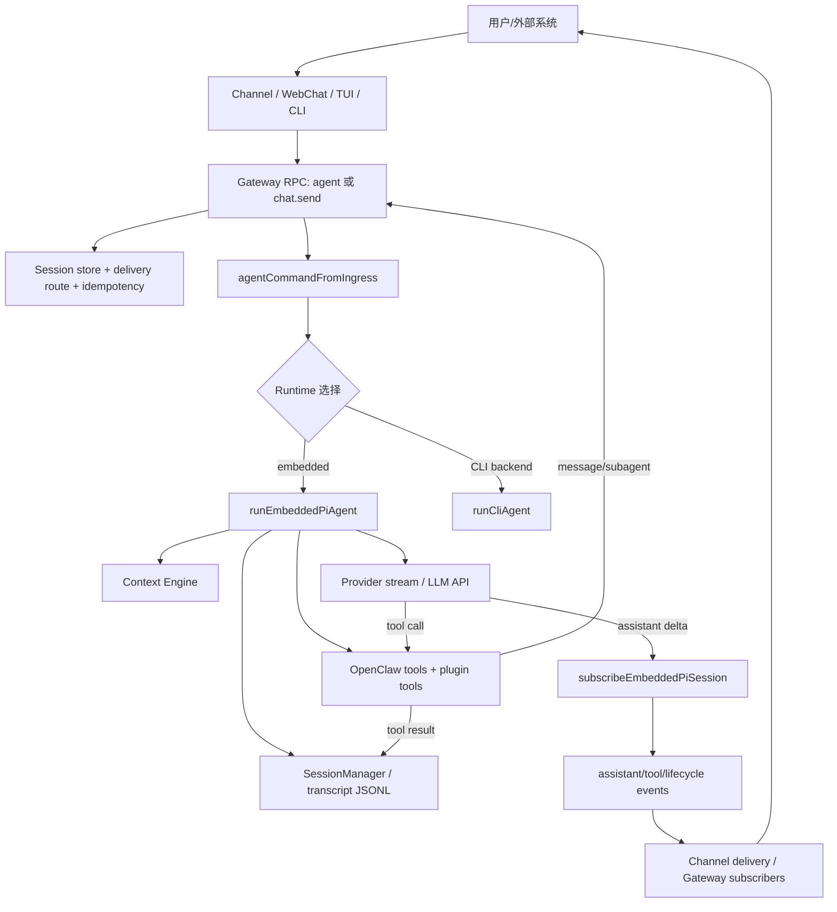
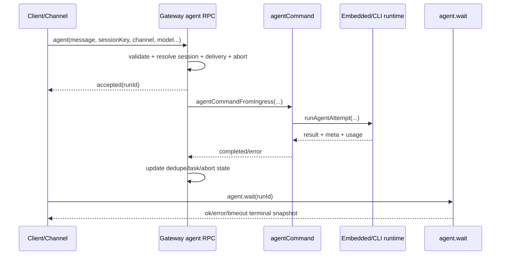
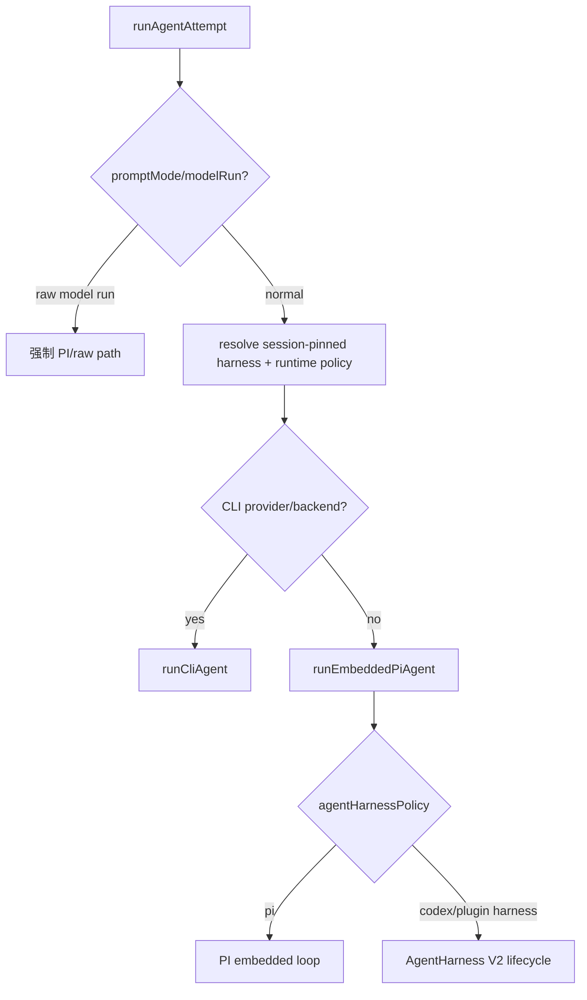
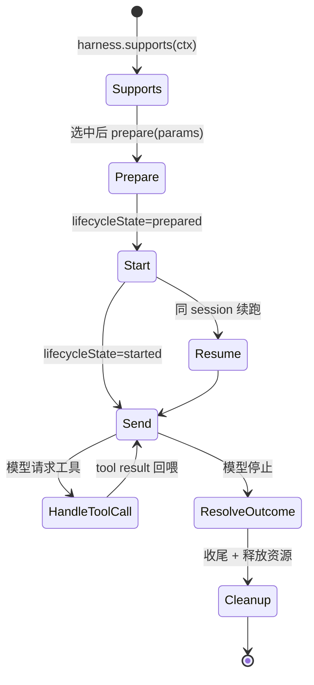
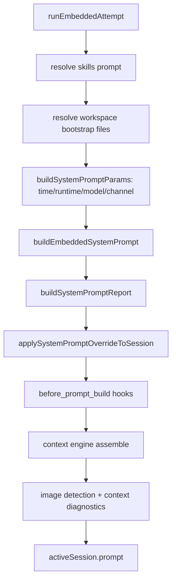
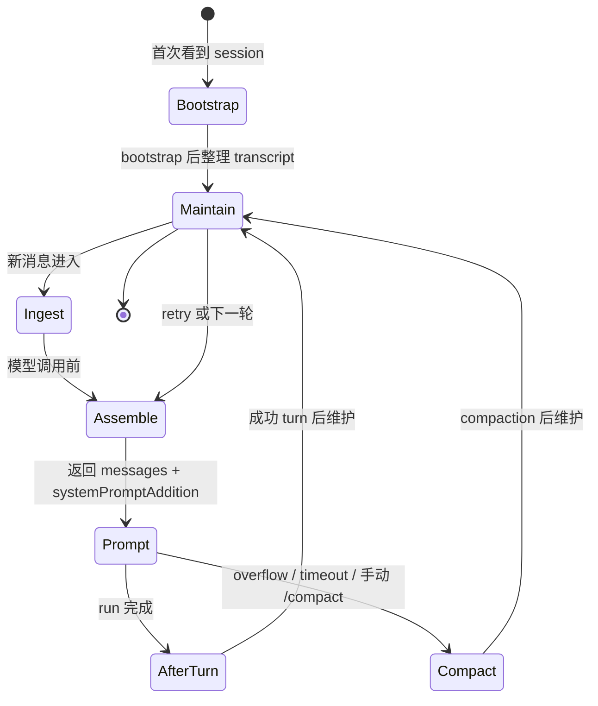
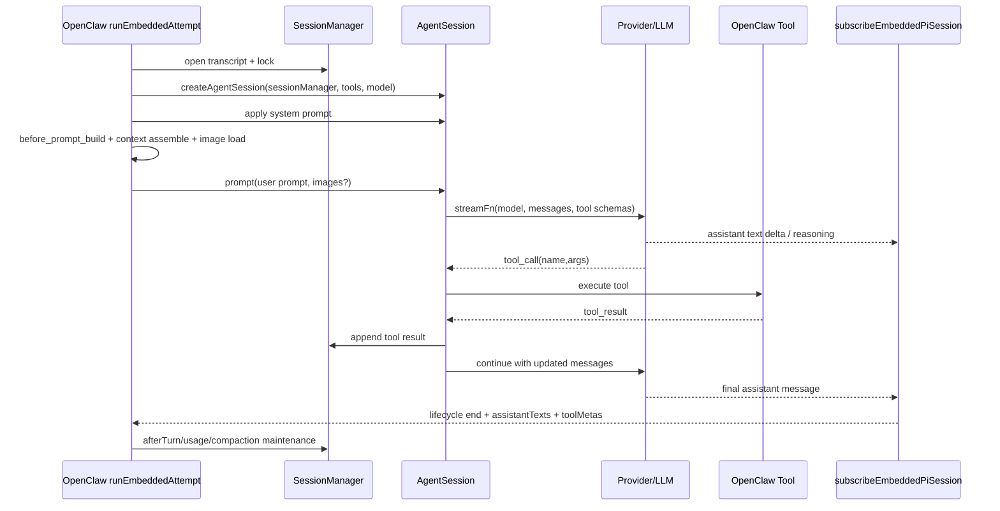
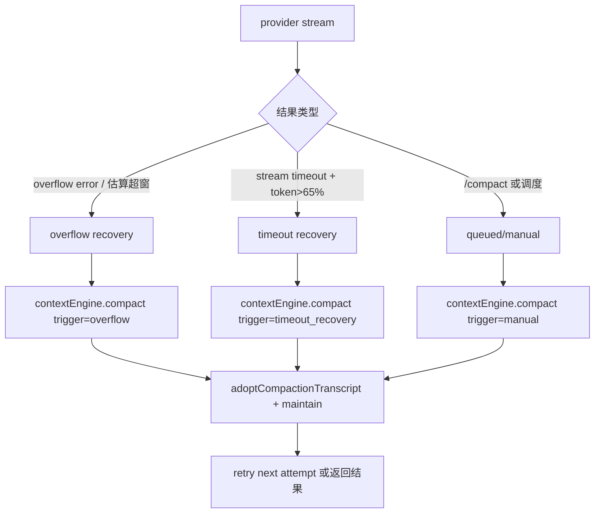
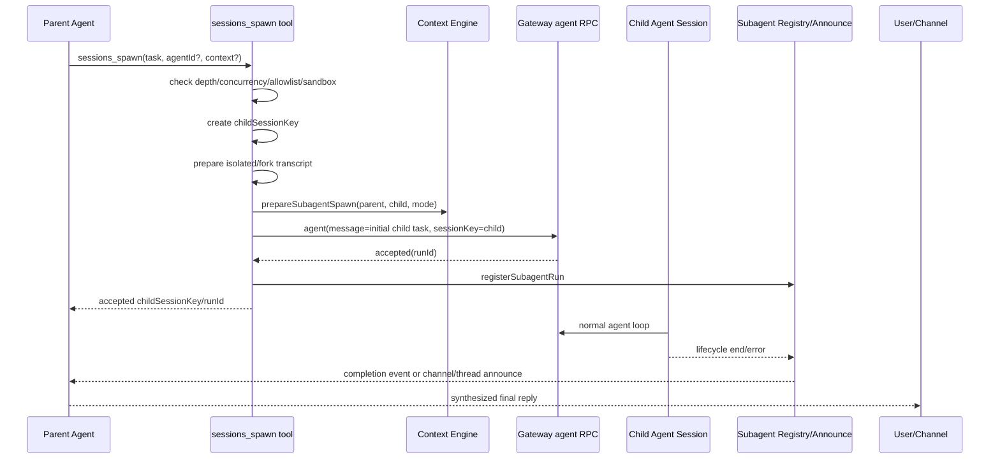
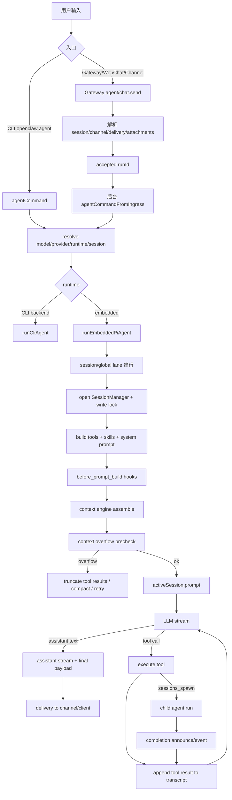

# OpenClaw 运行原理分析

本文基于 `../openclaw` 源码与全局安装包 `/opt/homebrew/lib/node_modules/openclaw` 的入口文件整理。目标是解释：用户在 OpenClaw 中发起一个请求后，agent 如何协同，context 如何组织，OpenClaw 如何与 LLM 多轮交互并完成任务。

## 结论摘要

OpenClaw 是一个“多入口消息网关 + session 化 agent runtime + 插件/工具编排层”。用户请求可以来自 CLI、Gateway RPC、WebChat/TUI 或各类消息 channel。核心执行路径会统一到 `agent` 请求和 `agentCommand`：

1. Gateway 接收请求，解析 channel、session、agentId、交付目标、附件和幂等键。
2. Gateway 立即返回 `accepted`，后台异步运行 agent，并用 `runId` 追踪生命周期。
3. `agentCommand` 解析模型、runtime、session transcript、技能快照和 fallback 策略。
4. 执行层根据 runtime 选择 CLI backend 或 embedded PI/Codex harness。默认嵌入式路径进入 `runEmbeddedPiAgent`。
5. `runEmbeddedPiAgent` 按 session lane 串行化同一 session 的执行，创建 `SessionManager`、工具、系统提示和 provider stream。
6. 每次 LLM 调用前，OpenClaw 组装 context：系统提示、session 历史、当前 prompt、工具 schema、附件、workspace bootstrap 文件、plugin hook 注入、context engine 结果。
7. LLM 返回 assistant token 或 tool call。工具执行结果写回 transcript，再触发下一次 provider stream，直到模型停止、超时、yield、错误或 compaction retry。
8. `subscribeEmbeddedPiSession` 把 PI/Codex runtime 事件桥接成 OpenClaw 的 `assistant`、`tool`、`lifecycle` 流；最终结果由 channel delivery 或 message tool 发回用户。
9. agent 协同主要通过 `sessions_spawn`、`subagents`、session tools、thread binding 和 context engine 的 subagent lifecycle hook 实现。子 agent 默认隔离上下文，只有显式 `context: "fork"` 时才继承父 transcript。

## 主要源码证据

- CLI/npm 入口：安装包 `openclaw.mjs` 要求 Node 22.12+，加载 `./dist/entry.js` 或 `./dist/entry.mjs`；源码 checkout 版本额外处理 source compile cache。证据：`openclaw.mjs:1-180`，安装包版本 `package.json` 为 `2026.4.14`，源码版本为 `2026.4.27`。
- Gateway `agent` RPC：`src/gateway/server-methods/agent.ts:395-430` 定义 `agent` handler；`src/gateway/server-methods/agent.ts:1079-1119` 注册 abort controller、计算 timeout、写入 accepted dedupe 并立即响应；`src/gateway/server-methods/agent.ts:1168-1224` 调用后台 `dispatchAgentRunFromGateway`。
- 后台调度：`src/gateway/server-methods/agent.ts:288-392` 用 `agentCommandFromIngress` 异步运行，并在完成/失败后更新 dedupe、task 记录和 abort controller。
- `agent.wait`：`src/gateway/server-methods/agent.ts:1297-1345` 根据 `runId` 等待 terminal lifecycle 或读取 gateway dedupe 快照。
- `agentCommand` 到执行层：`src/agents/agent-command.ts:925-1003` 通过 `runWithModelFallback` 调用 `attemptExecutionRuntime.runAgentAttempt`，并监听 lifecycle 结束事件。
- Runtime 分流：`src/agents/command/attempt-execution.ts:235-333` 解析 raw run、session-pinned harness、CLI provider 和 agent runtime policy；`src/agents/command/attempt-execution.ts:360-455` 走 CLI backend；`src/agents/command/attempt-execution.ts:457-509` 走 `runEmbeddedPiAgent`。
- 嵌入式执行队列：`src/agents/pi-embedded-runner/run.ts:273-350` 回填 sessionKey、计算 session/global lane、串行入队并加载 runtime plugins。
- Context engine：`src/agents/pi-embedded-runner/run.ts:740-743` 每次 run 解析一次 context engine；`src/context-engine/types.ts:170-306` 定义 `bootstrap`、`maintain`、`ingest`、`assemble`、`compact`、`afterTurn`、`prepareSubagentSpawn` 等生命周期；`src/context-engine/legacy.ts:21-87` 显示默认 legacy engine 是 pass-through + 委托 compaction（不实现 `maintain`）。
- Context engine maintenance：`src/agents/pi-embedded-runner/context-engine-maintenance.ts:308-343` 定义 `executeContextEngineMaintenance`，区分前台/后台模式、调用 `runtimeContext.rewriteTranscriptEntries()` 完成 branch-and-reappend。
- Compaction 三类触发：`src/agents/pi-embedded-runner/run.ts:1287-1370`（overflow recovery）、`run.ts:1131-1210`（timeout recovery）、`src/agents/pi-embedded-runner/compact.queued.ts:140-180`（queued/manual）；支撑模块 `compact.ts`、`compact.runtime.ts`、`compact.queued.ts`、`compaction-safety-timeout.ts`、`compaction-successor-transcript.ts`、`compaction-duplicate-user-messages.ts`、`compact-reasons.ts`。
- Backend 抽象 + HTTP runtime：`src/agents/pi-embedded-runner/run/backend.ts:4-8` 委托给 `runAgentHarnessAttemptWithFallback`；`src/agents/pi-embedded-runner/run/attempt-http-runtime.ts:7-14` 配置 undici proxy + stream timeout；`src/agents/pi-embedded-runner/run/attempt-bootstrap-routing.ts` 抽离 bootstrap 路由决策。
- AgentHarness V2：`src/agents/harness/v2.ts:53-71` 定义 V2 接口（`supports`/`prepare`/`start`/`send`/`handleToolCall`/`resolveOutcome`/`cleanup` + 可选 `compact`/`reset`/`dispose`）；`src/agents/harness/selection.ts` 处理选择/回退分类；`src/agents/harness/context-engine-lifecycle.ts:76-117` 在 V2 send 前后调用 `assemble`/`afterTurn`，让 context engine 同时服务 PI 与 codex/plugin harness。
- 系统提示和 session：`src/agents/pi-embedded-runner/run/attempt.ts:1059-1218` 构建 runtime metadata、skills prompt、tools、workspace context files 和 system prompt report；`src/agents/pi-embedded-runner/run/attempt.ts:1228-1319` 获取 session write lock、打开 `SessionManager`、运行 context-engine bootstrap、准备 PI settings。
- LLM prompt 前处理：`src/agents/pi-embedded-runner/run/attempt.ts:2268-2348` 运行 `before_prompt_build` hook 并支持 prompt/system prompt 注入；`src/agents/pi-embedded-runner/run/attempt.ts:2475-2523` 计算 runtime context、加载 prompt 图片、记录 `context.compiled`；`src/agents/pi-embedded-runner/run/attempt.ts:2548-2575` 发出 `context.assembled` 诊断事件。
- LLM 多轮交互：`src/agents/pi-embedded-runner/run/attempt.ts:1418-1438` 创建 PI `AgentSession` 并应用 system prompt；`src/agents/pi-embedded-runner/run/attempt.ts:1587-1630` 选择 provider stream；`src/agents/pi-embedded-runner/run/attempt.ts:2701-2748` 调用 `activeSession.prompt(...)`，携带图片时传入 images。
- 流事件桥接：`src/agents/pi-embedded-runner/run/attempt.ts:2086-2143` 创建 `subscribeEmbeddedPiSession` 并取得 assistant/tool/compaction 状态；`src/agents/pi-embedded-subscribe.ts:77-145` 维护 assistant text、tool meta、reasoning、compaction、message tool 去重等状态；`src/agents/pi-embedded-subscribe.ts:260-308` 负责最终 assistant text 与 message tool 去重。
- 子 agent：`src/agents/tools/sessions-spawn-tool.ts:197-230` 定义 `sessions_spawn` 工具参数；`src/agents/subagent-spawn.ts:647-763` 解析 context/mode、深度、并发、目标 agent 策略并生成 child sessionKey；`src/agents/subagent-spawn.ts:846-853` 准备隔离/ fork 上下文；`src/agents/subagent-spawn.ts:1022-1042` 调用 context engine 的 subagent spawn hook；`src/agents/subagent-spawn.ts:1057-1085` 通过 Gateway `agent` 方法启动 child run；`src/agents/subagent-spawn.ts:1154-1251` 注册 run、发 lifecycle hook 并返回 accepted。

## 总体架构



层次上可以分为：

| 层 | 责任 |
| --- | --- |
| Channel/Client | 把 Telegram、Discord、WebChat、TUI、CLI 等输入归一化为 OpenClaw 请求，或把输出发回用户。 |
| Gateway | RPC 协议、鉴权、session 解析、delivery route、幂等、abort、`agent.wait`、SSE/WebSocket broadcast。 |
| Agent command | 解析模型/provider/runtime、session transcript、技能、thinking/verbose、fallback、auth profile。 |
| Agent runtime | 拥有一次准备好的模型循环。默认 PI embedded，也可以是 Codex embedded harness 或 CLI backend。 |
| Context engine | 参与 context bootstrap、assemble、compact、afterTurn，以及 subagent context 生命周期。 |
| Tools/plugin layer | 暴露文件、shell、message、session、subagent、media、plugin tools，并在 before/after hook 中拦截。 |
| Session/transcript | 记录历史消息、工具调用、工具结果、usage、compaction 结果，是下一轮 context 的历史来源。 |

## 请求入口与 Gateway 调度

用户请求进入 OpenClaw 后，最终常见路径是 Gateway 的 `agent` RPC。`agent` handler 做几件关键事：

1. 校验参数，包括 message、agentId、model、sessionKey、channel、attachments、delivery 等。
2. 解析 session：显式 sessionKey、agent main session、subagent session、channel 绑定 session 都会被归一化为一个 run 使用的 sessionKey/sessionId。
3. 解析 reply/delivery 路由：如果请求要求发回某个 channel，Gateway 会决定 channel、account、to、threadId；如果不可交付且允许 best-effort，会降级为 session-only。
4. 注册 abort controller：让 `/stop`、chat abort、超时或 gateway shutdown 能取消正在运行的 run。
5. 写 accepted dedupe 并立即返回：

```json
{
  "runId": "...",
  "status": "accepted",
  "acceptedAt": 1710000000000
}
```

6. 后台调用 `agentCommandFromIngress`，完成后再写入 terminal dedupe 快照。客户端可以用 `agent.wait` 等待这个 run 完成。



## agentCommand 与 runtime 选择

`agentCommand` 是 Gateway 和实际 runtime 之间的主适配层。它会：

- 解析 agent workspace、agentDir、session transcript 文件。
- 解析 provider/model，以及 explicit override、session override、fallback 配置。
- 加载技能 snapshot，并把技能 prompt/env 传给 runtime。
- 处理 thinking/verbose/trace/reasoning 等运行设置。
- 用 `runWithModelFallback` 包装一次或多次 attempt。当某个 provider/model 失败且符合 fallback 条件时，换候选模型重试。
- 监听 runtime 的 `lifecycle` 事件。如果 runtime 没有发 terminal lifecycle，`agentCommand` 会补发 end/error。

runtime 分流主要发生在 `runAgentAttempt`：



OpenClaw 文档把 Provider、Model、Agent runtime 和 Channel 明确分层：

- Provider 是认证、模型目录和模型 ref 命名层，例如 `openai`、`anthropic`、`openai-codex`。
- Model 是具体模型，例如 `gpt-5.5`。
- Agent runtime 是执行一次 prepared turn 的循环，例如 `pi`、`codex`、`claude-cli`。
- Channel 是消息进出的平台。

因此 `openai/gpt-5.5 + agentRuntime.id: "codex"` 的含义是：模型 ref 来自 OpenAI provider，但模型循环由 Codex app-server harness 执行。

### Backend 抽象与 HTTP runtime 配置

`runEmbeddedPiAgent` 不直接调用 PI/Codex 的内部 API，而是经过两个分层：

- `src/agents/pi-embedded-runner/run/backend.ts:4-8`：`runEmbeddedAttemptWithBackend` 是 attempt 与具体 harness 之间的边界，单纯转发到 `runAgentHarnessAttemptWithFallback`。这给 V2 harness 注入、单测替换、未来再加新 backend 留出了入口。
- `src/agents/pi-embedded-runner/run/attempt-http-runtime.ts`：`configureEmbeddedAttemptHttpRuntime({ timeoutMs })` 在每次 attempt 开始前确保全局 undici proxy dispatcher (`ensureGlobalUndiciEnvProxyDispatcher`) 已就位，并把 stream 超时调到 `max(timeoutMs, DEFAULT_UNDICI_STREAM_TIMEOUT_MS)`。代理初始化必须在超时调整之前，否则代理 dispatcher 会替换掉超时包装。
- `src/agents/pi-embedded-runner/run/attempt-bootstrap-routing.ts`：把 workspace bootstrap 的路由决策（是否注入 `BOOTSTRAP.md`、user prompt prefix 怎么拼、是否从 context 中剔除）抽离成纯函数，可被 `runEmbeddedAttempt` 与单测共享。

这三个文件的存在意义是：让 attempt 主流程聚焦“session/transcript/LLM 循环”，把网络层、bootstrap 路由、harness backend 这些横切关注点放到边界模块。

### AgentHarness V2 lifecycle

当 runtime 是 `codex` 或来自插件时，attempt 不再直接驱动 PI `AgentSession`，而是走 `src/agents/harness/v2.ts` 定义的 V2 lifecycle。它把"一次 attempt"拆成显式阶段：



接口要点（`src/agents/harness/v2.ts:53-71`）：

- `supports(ctx)`：harness 自检是否能处理当前 provider/model。返回 `priority` 用于多 harness 排序。
- `prepare(params)` → `prepared` run：可在此预解析 prompt、token 预算、子进程 args，但不开网络连接。
- `start(prepared)` → `started` session：建立长连接、子进程或 app-server thread。
- `send(session)` → `AgentHarnessAttemptResult`：跑一次完整 turn（含内部工具循环）。
- 可选 `handleToolCall(session, call)`：让 OpenClaw 在 V2 流中拦截工具，统一应用工具策略与中间件。
- `resolveOutcome(session, result)`：harness 最后一次机会清洗结果，例如把内部错误归一化为 OpenClaw error code。
- `cleanup({ prepared?, session?, result?, error? })`：在成功、失败、或 prepare 失败但 start 没跑时都会被调用，确保资源回收。
- 可选 `compact(params)` / `reset(params)` / `dispose()`：分别支持 owns-compaction harness、session 强制重置、跨进程 dispose。

选择与回退（`src/agents/harness/selection.ts`）的关键路径：

- `runAgentHarnessAttemptWithFallback` 是 backend 的真正入口，调用 `selectAgentHarness` 决定本轮使用哪个 harness。
- 决策结果分类：`pinned`、`forced_pi`、`forced_plugin`、`forced_plugin_fallback_to_pi`、`auto_plugin`、`auto_pi_fallback`，对应 session pin、配置强制、用户强制、插件不可用回落、自动选中、自动找不到回落到 PI。
- `adaptAgentHarnessToV2(harness)` 把 V1（旧 PI/Codex harness）适配到 V2 lifecycle，使新旧 harness 可在同一调度中共存。
- `runAgentHarnessV2LifecycleAttempt` 在每个阶段发 `DiagnosticHarnessRunErrorEvent`/`DiagnosticHarnessRunOutcome`，并通过 `applyAgentHarnessResultClassification` 写入 trajectory recorder。

V2 与 context engine 的衔接放在 `src/agents/harness/context-engine-lifecycle.ts`：在 V2 send 前后包一层 `assemble` / `afterTurn`，让插件 engine 在 codex/plugin runtime 下也能参与 prompt 组装、turn 收尾。这意味着同一个 context engine 既能服务 PI embedded loop，也能服务 codex/plugin harness，无需双份实现。

## Context 的组织方式

OpenClaw 中 context 不是单一字符串，而是一次 run 发送给模型的全部材料。它包括：

| Context 来源 | 说明 |
| --- | --- |
| System prompt | OpenClaw 每次 run 重建，包含工具说明、技能列表、workspace、时间、runtime metadata、channel hints、sandbox 信息、provider/system contribution。 |
| Project Context | 默认注入 workspace 中的 `AGENTS.md`、`SOUL.md`、`TOOLS.md`、`IDENTITY.md`、`USER.md`、`HEARTBEAT.md`、首次 `BOOTSTRAP.md`，并按字符预算截断。 |
| Session transcript | 当前 session 的用户消息、assistant 消息、tool calls、tool results、compaction summary。 |
| 当前 prompt | 本轮用户输入，可能被 startup context、bootstrap warning、runtime context、hook prepend/append 修改。 |
| Tool definitions | 工具列表文本进入 system prompt；工具 schema 作为 provider tool schema 发送给模型，也占上下文窗口。 |
| 附件/媒体 | 图片、音频、文件、URL 或 channel attachment 会被解析为 prompt 注释、media reference 或 provider images。 |
| Plugin hook 注入 | `before_prompt_build` 可以注入 `prependContext`、`appendContext`、`systemPrompt`、`prependSystemContext`、`appendSystemContext`。 |
| Context engine | 默认 legacy engine 透传历史；插件 engine 可 assemble 精简后的 messages，并返回 `systemPromptAddition`。 |

源码中系统提示构建集中在 `run/attempt.ts`：



### Context engine 生命周期

默认 `legacy` context engine 的行为很保守：

- `ingest`：no-op，消息由 `SessionManager` 持久化。
- `assemble`：pass-through，返回原 messages。
- `compact`：委托内置 compaction (`delegateCompactionToRuntime`)。
- `afterTurn`：no-op。
- `maintain`：未实现（legacy engine 不导出该方法，等价于跳过）。

完整可选生命周期（见 `src/context-engine/types.ts:170-306`）：`bootstrap` → `ingest` / `ingestBatch` → `assemble` → `compact` → `afterTurn` → `maintain` → `prepareSubagentSpawn`。其中 `maintain()` 在 `bootstrap`、成功 turn、compaction 之后被调用，专用于 transcript 维护（branch-and-reappend 重写），engine 通过 `runtimeContext.rewriteTranscriptEntries()` 提交安全重写请求，无需直接依赖 PI 内部接口。调度入口在 `src/agents/pi-embedded-runner/context-engine-maintenance.ts:308-343`，并区分前台与后台执行模式（后台模式可 defer 到 session lane）。

插件 engine 可以接管更多工作：



关键点：

- `resolveContextEngine(config)` 根据 `plugins.slots.contextEngine` 选择 engine，默认是 `legacy`。
- `assemble()` 可以改变发送给模型的历史消息集合，也可以通过 `systemPromptAddition` 注入动态记忆/检索提示。
- `ownsCompaction: true` 的 engine 会让 OpenClaw 禁用 PI 内置 auto-compaction，由 engine 自己负责 compaction。
- `maintain()` 是 transcript 重写的统一入口；engine 不应自行写 session 文件，必须经 `runtimeContext.rewriteTranscriptEntries()` 走 session write lock 路径。
- subagent spawn 时，engine 可通过 `prepareSubagentSpawn()` 准备父子上下文关系；spawn 失败则 rollback。

## LLM 多轮交互机制

OpenClaw 的 embedded loop 不是一次简单 HTTP completion，而是一个“LLM stream + tool execution + transcript append + 再次 LLM stream”的循环。PI/Codex runtime 维护 `AgentSession`，OpenClaw 包装其 streamFn、tools 和 session manager。

一次 turn 内的多轮大致如下：



源码上能看到几个重要保护层：

- `runEmbeddedPiAgent` 按 session lane 和 global lane 入队，避免同一 session 并发写 transcript。
- `SessionManager.open(sessionFile)` 在 session write lock 内打开，后续 compaction、rewrite、truncate 都要走同一类锁语义。
- `activeSession.agent.streamFn` 会被多层包装：provider stream、WebSocket transport、prompt cache、provider text transform、history sanitization、tool call repair、idle timeout、diagnostic model call events。
- prompt 前会做 context overflow precheck。若估算超过窗口，会先截断 oversized tool results，或触发 compaction，再 retry。
- `subscribeEmbeddedPiSession` 负责把底层事件聚合为 OpenClaw 可交付的 assistant/tool/lifecycle stream，同时做 message tool 去重，避免“工具已经发过消息后 assistant 又重复确认”。

### 工具调用为什么会形成多轮

LLM 第一次看到的是当前 messages + tool schemas。如果它决定调用工具，provider 返回 tool call，而不是最终文本。PI runtime 执行工具后把 tool result 加入 messages，再向 provider 继续请求。这个循环直到：

- 模型输出最终 assistant 文本；
- 模型返回 `end_turn`；
- 工具或 provider 报错；
- context 太大触发 compaction/retry；
- 用户或系统 abort；
- `sessions_yield` 让当前 agent 让出，等待子任务或后续事件。

### Compaction 的三类触发与队列

Compaction 不是单一 overflow 路径，而是由 `runEmbeddedPiAgent` 维护一个状态机，覆盖至少三类触发，每类都通过同一个 `contextEngine.compact()` 入口，但用不同的 `trigger` 与运行参数：

| 触发 | 入口 | 关键字段 | 行为 |
| --- | --- | --- | --- |
| Overflow recovery | `run.ts:1287-1370` | `trigger: "overflow"`，`compactionTarget: "budget"`，`force: true`，附带 `currentTokenCount` | provider 返回 context overflow / 估算超窗时进入；compaction 成功后 `adoptCompactionTranscript` 并触发 `runContextEngineMaintenance({ reason: "compaction" })` 再 retry。 |
| Timeout-triggered compaction | `run.ts:1131-1210` | `trigger: "timeout_recovery"`，`force: true` | LLM stream 超时且 prompt token 占比 > 65% 时进入；最多 `MAX_TIMEOUT_COMPACTION_ATTEMPTS` 次，与 overflow 计数独立。 |
| Queued / 手动 compaction | `compact.queued.ts:140-180` | `trigger: "manual" / ...`，`compactionTarget: "threshold" / "budget"` | 来自 `/compact`、调度任务或外部 RPC；先跑 `before_compaction` hook，必要时 `rotateTranscriptAfterCompaction` 旋转 transcript。 |

支撑模块：

- `compact.ts`（1296 行）：核心 compaction 实现 + summary prompt 构建。
- `compact.runtime.ts` / `compact.runtime.types.ts`：把 compaction 与 runtime context（provider、prompt cache、reply delivery、ownerNumbers、senderIsOwner 等）绑定，给 engine 提供完整的“它正处于哪个 run”视图。
- `compact.queued.ts`（330 行）：单 session 单进程 queue，避免并发 compaction 互踩。
- `compaction-safety-timeout.ts`：包装 compaction 自身的 watchdog，防止 compaction 卡死整个 session lane。
- `compaction-successor-transcript.ts`：处理 compaction 后的 successor transcript（把旧 transcript 旋转/归档，链接到新文件）。
- `compaction-duplicate-user-messages.ts`：对 compaction summary 中误重复的 user message 去重。
- `compact-reasons.ts`：用枚举固化 trigger / target / outcome，统一写到诊断事件。



关键不变量：

- 同一 session 同一时刻只跑一种 compaction，由 `compact.queued` 串行；其它请求阻塞。
- compaction 成功后必须走 `runContextEngineMaintenance({ reason: "compaction" })`，否则 engine-owned 的 transcript 重写不会落盘。
- `ownsCompaction: true` 的 engine 把上述路径全部交给 engine 实现；OpenClaw 仅充当调度。

## Agent 协同机制

OpenClaw 中“多 agent 协同”不是多个 agent 自动共享同一个 prompt，而是通过 session 工具和 Gateway 再入实现：

1. 父 agent 在 LLM 循环中调用 `sessions_spawn`。
2. `sessions_spawn` 创建新的 child sessionKey，例如 `agent:<targetAgentId>:subagent:<uuid>`。
3. OpenClaw 检查深度、并发、目标 agent allowlist、sandbox 继承、model/thinking override 权限。
4. 默认 `context: "isolated"`，child 有干净上下文；显式 `context: "fork"` 时复制父 session transcript。
5. context engine 收到 `prepareSubagentSpawn`，可建立父子上下文状态。
6. `sessions_spawn` 通过 Gateway `agent` 方法启动 child run，本质上子 agent 也是一次普通 `agent` RPC。
7. 父 agent 立即收到 accepted note。系统提示要求不要轮询子任务，必要时用 `sessions_yield` 等待 completion event。
8. 子 agent 完成后，registry/announce 机制把结果送回父 session 的 channel/thread 或作为后续 user message 进入父 session。
9. 父 agent 收到子结果后继续综合，必要时再调用 `subagents(action=steer|kill|list)` 管理子 run。



### 子 agent 的上下文边界

`sessions_spawn` 支持两种 native subagent context：

| 模式 | 行为 |
| --- | --- |
| `isolated` | 默认。child session 不继承父 transcript，只收到 child system prompt 和 initial user task。适合独立检索、实现、验证。 |
| `fork` | 显式请求。OpenClaw 准备 forked context；若无法准备父 entry/fork transcript 会报错。适合需要父会话历史的子任务。 |

这意味着 agent 协同的默认安全边界是“隔离会话 + 显式结果回传”，不是“共享一整个上下文窗口”。这样可以减少 token 压力，也降低子 agent 误读父 agent 临时推理的风险。

## 回复、流式输出和交付

OpenClaw 的输出不只是一段最终文本。runtime 会产生三类事件：

- `assistant`：assistant delta、block reply、reasoning stream、最终文本。
- `tool`：工具开始、更新、结束、结果摘要。
- `lifecycle`：start、end、error。

Channel 侧可以选择：

- 缓冲 assistant delta，等 lifecycle terminal 后发 final。
- block streaming：按段落或 message end 发 partial reply。
- 工具输出 streaming：verbose 或工具策略允许时，把工具摘要发给用户。
- message tool 直接发消息：例如 agent 调用 `message`/`sessions_send` 已经向 channel 发送内容，最终 assistant 重复文本会被抑制。

最终回复构造会过滤 `NO_REPLY/no_reply`，并在没有 renderable payload 且工具错误时提供 fallback error reply。

## 与安装包的关系

全局安装包 `/opt/homebrew/lib/node_modules/openclaw` 是构建后的 npm 包。其 `openclaw.mjs` 做最小 bootstrap：

- 校验 Node 版本。
- 启用 Node compile cache。
- 加载 warning filter。
- 优先输出预计算 help。
- 最终 import `dist/entry.js` 或 `dist/entry.mjs`。

因此运行时主逻辑仍对应源码中的 TypeScript 模块，只是在安装包中变成 `dist/**`。当前安装包版本 `2026.4.14` 低于源码 checkout 的 `2026.4.27`，分析以源码为主，安装包仅用于确认发布入口与 CLI bootstrap。

## 一次用户请求的端到端流程



## 关键设计取舍

1. **Gateway 先 accepted，后台执行**：避免长 LLM/tool run 阻塞 RPC；`agent.wait` 用 runId 补齐同步等待语义。
2. **session lane 串行化**：同一 session 内只有一个 active run 写 transcript，减少工具结果、compaction 和历史重放竞态。
3. **context 每轮重建**：系统提示、工具、技能、runtime metadata、bootstrap 文件和 hook 注入都按当前配置重算；transcript 提供连续历史。
4. **context engine 可插拔**：默认兼容旧行为，插件可替换 `bootstrap`/`assemble`/`compact`/`afterTurn`/`maintain`/`prepareSubagentSpawn`，并通过 `runtimeContext.rewriteTranscriptEntries()` 安全重写 transcript。
5. **工具循环由 runtime 驱动，OpenClaw 做边界包装**：底层 runtime 负责 LLM-tool continuation，OpenClaw 负责工具注册、策略、流桥接、清洗、诊断、delivery。
6. **子 agent 是 session 级隔离，而非线程内函数调用**：`sessions_spawn` 通过 Gateway 再入启动完整 agent loop，具有独立 transcript、model/runtime、sandbox、delivery 和生命周期。
7. **消息 channel 与 agent runtime 解耦**：同一个 agent loop 可以从 Telegram/Discord/WebChat/CLI 触发，最终 route 由 delivery context 决定。
8. **AgentHarness V2 把 attempt 拆成显式阶段**：`prepare → start → send → handleToolCall → resolveOutcome → cleanup` 让 codex/plugin harness 与 PI 共享同一调度，并通过 `adaptAgentHarnessToV2` 兼容旧 V1 harness。
9. **Compaction 三类触发统一入口**：overflow / timeout / 手动都走 `contextEngine.compact()`，仅以 `trigger` 字段区分；compaction 后强制 `runContextEngineMaintenance({ reason: "compaction" })`，避免 engine-owned transcript 重写遗漏。
10. **横切关注点边界化**：`run/backend.ts` 隔离 harness 选择，`attempt-http-runtime.ts` 隔离 undici proxy/timeout，`attempt-bootstrap-routing.ts` 隔离 bootstrap 路由——使 attempt 主流程只关心 LLM 循环本身。

## 不确定点与边界

- 本文没有运行真实 Gateway 或 provider live test，因此 provider SDK 的网络层行为只按源码路径解释。
- Codex embedded harness 的内部 app-server thread 状态由 Codex runtime 拥有；本文只覆盖 OpenClaw 如何选择并调用 harness，未展开 Codex app-server 内部实现。
- 安装包版本与源码版本不同；若用户本机实际运行的是全局包，细节可能落后于源码 checkout。

